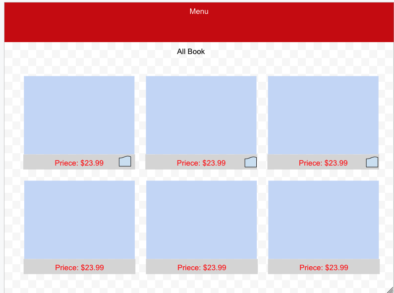
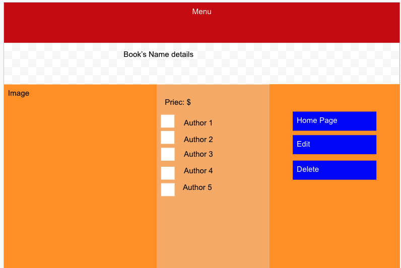
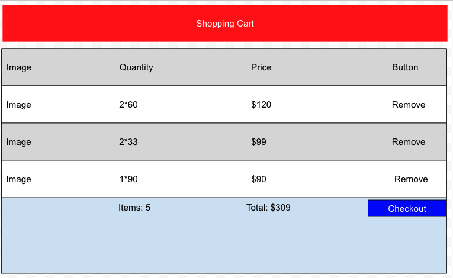
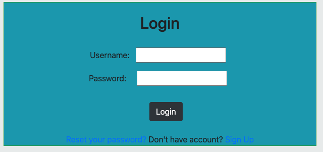
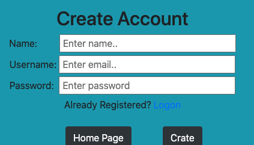
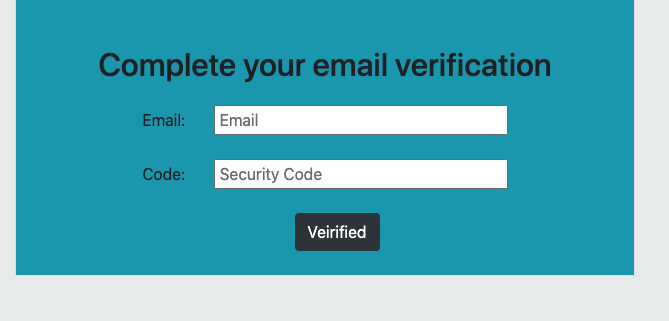
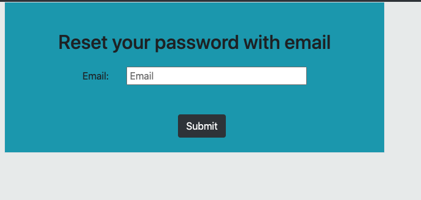
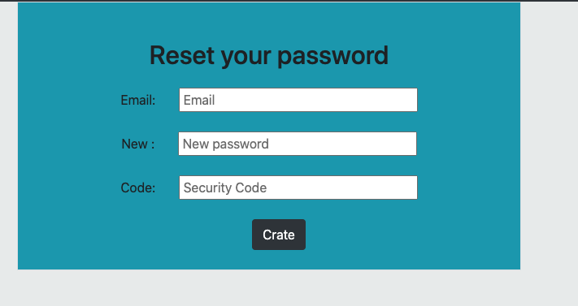
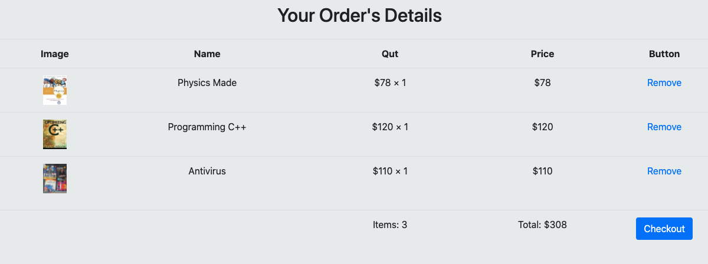
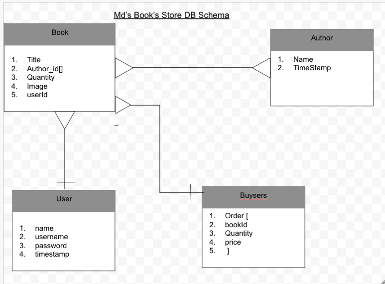

# 
Project#2: Md's Book Store 

## Overview: 

This is an online book store where people will be able to create their account by using valid email address. Then the user should be able to login and add their own products to sell on this web app. 
   
## List of Technology

* <u>Node Js :</u> Node js is used here as a programming language.
* <u>Express:</u>  helps us to work with HTTP request such as GET, POST, PUT, DELETE etc. 
* <u> MongoDB :</u> mongodb is used for storing users and products data
* <u>Mongoose:</u> Monoose is used for helping with the schema and transferring the data from UI to dabase. 
* <u>Ejs :</u> Embadded Java Script helps to add some login within HTML code. 
* <u>Heroku :</u> It is a cloud application platfomr, our project is deployed in AWS through Heroku, that helps us directly connect with our github account and continus deploye. 
* <u> Git / Gitbut :</u> for maintaining our code repository
* <u> Dotenv :</u> for working with dev environment setting.
* <u>Epress Ejs Layout :</u> it helps us to reduce a lot of code duplication. For example, we keept our nev bar in one file and can be used for all the page. 
* <u>Method Override :</u> We can pass data through POST call, and for any other http method like delete, put we need to over override the method, and method override is helpping us. 
* <u>Express Session :</u> Helps us to maintain user's login session for authentication purpose. 
* <u>Multer :</u> Multer helps to upload image file in database as binary formate. 
* <u>Nodemailer :</u> Nodemailer helps for sending email thrgouh gmail SMPT server. 
* <u> Bootstrap :</u> Bootstrap framework is used for desigining and make the web page responsive. 
* <u> HTML: </u> How creating web page.
* <u> CSS :</u> Used for custom design and alignmen

## User Stories

### Books

1. User should be able to add new Books
2. User should be able to see the list of all the book
3. User should be able to see authors of each book
4. User should be able to add any authors from the list of authors
5. User should be able to go back to the list of books
6. User should be able to update book
7. User should be able to delete the book 
8. User should be able to see all the author listed for the book
9. User should be able to upload user's book's image
9. User should be able to add new **Author** if the author is not listed
10. User should be able to complete their registration by using a valid email address

## Potential Extra Features for Md's Book's Store

11. User should be able to reset user's password through email as forget password
12. None registered user should not be able to add, delete, and update any book for selling
13. User should be able to logout and invalid user name should not allow to login
14. None registered user should be able to add the books in shopping cart
15. None registered user should be able to click on shopping cart and able to see all the books, quantity, price and total quantity, and total price
16. User should be able to remove the selected books from the shopping cart. 
17. User should be able to click on checkot button to place the oreder. 
18. Registered user should be able to see all the oreder id and date after login to their account. 
19. Registered user should be able to add, delete, and update only their books, one registered user should not be able to update any other user's books. 
20. User should be able to see the list of author, but not all the big list, if the list of bigger, user should be able to scroll up and down to see the user. 
21. All the feature should work on dekstop and mobile screen. 

## Wareframe

 
  ### Home Page 
  

  ### Show Page 
   

 ### Shopping Cart 
  

  ### User Login  
   

 ### Signup Page One
  

 ### Signup Page completing from the email
  

 ### Request for Password Reset Code
  

 ### Complete Password Reset
  

 ### Shopping Cart
  

## Databse Schema
  

## All The Rest Routes That I have in this app

|               	|                 	|   Book Controllers 	|                                 	|            	|
|------------------	|-----------------	|-----------	|-----------------------------------------	|------------	|
| Route Name       	| URL             	| HTTP Verb 	| Description                             	| Status     	|
| Index            	| /books          	| GET       	| Display a list of all Books             	| Completed  	|
| New              	| /books/new      	| GET       	| Show form to make new books             	| Completed  	|
| Create           	| /books          	| POST      	| Add New book to database, then redirect 	| Completed  	|
| Show             	| /books/:id      	| GET       	| Show info about one books               	|  Completed 	|
| Edit             	| /books/:id/edit 	| GET       	| Show edit form of one book              	| Completed  	|
| Update           	| /book/:id       	| PUT       	| Update a particular book, then redirect 	| Completed  	|
| Destroy          	| /books/:id      	| DELETE    	| Delete a particular book, then redirect 	| Completed  	|

|  |                 	|           	|                   Author Controllers                      	|            	|
|------------------	|-----------------	|-----------	|-----------------------------------------	|------------	|
| Route Name       	| URL             	| HTTP Verb 	| Description                             	| Status     	|
| New              	| /authors/new    	| GET       	| Show form to make new author                | Completed  	|
| Create           	| /authors        	| POST      	| Add new authors to database, then redirect  | Completed  	|

|               	|                 	|   User Controller|                                  	|            	|
|------------------	|-----------------	|-----------	|-----------------------------------------	|------------	|
| Route Name       	| URL             	| HTTP Verb 	| Description                             	| Status     	|
| New              	| /users/new      	| GET       	| Show form to make new user             	| Completed  	|
| Create           	| /users          	| POST      	| Add New user to database, then redirect 	| Completed  	|
| New             	| /users/reset  	| GET       	| Show form to verify by entring code from email | Completed  	|
| Update           	| /users/verify   	| PUT       	| Verify with a security code t             | Completed  	|
| Update          	| /users/resetpassword | PUT    	| User can setet the password by using code from email	| Completed  	|

|               	|                 	|   Order Controller|                                  	|            	|
|------------------	|-----------------	|-----------	|-----------------------------------------	|------------	|
| Route Name       	| URL             	| HTTP Verb 	| Description                             	| Status     	|
| Create            | /orders        	| POST      	| Add a new order in the database          	| Completed  	|
| Index             | /orders        	| GET        	| Display all the order id and time       	| Completed  	|

|               	|                 	|   Session Controllers 	|                                 	|            	|
|------------------	|-----------------	|-----------	|-----------------------------------------	|------------	|
| Route Name       	| URL             	| HTTP Verb 	| Description                             	| Status     	|
| New              	| /sessions/new   	| GET       	| Create cliet side session             	| Completed  	|
| Create           	| /sessions        	| POST      	| Create a new session for user login   	| Completed  	|
| Destroy          	| /sessions     	| DELETE    	| Destroy the session for user logout   	| Completed  	|

|               	|                 	|   Cart Controllers 	|                                 	|            	|
|------------------	|-----------------	|-----------	|-----------------------------------------	|------------	|
| Route Name       	| URL             	| HTTP Verb 	| Description                             	| Status     	|
| Index            	| /carts         	| GET       	| Show all the prodcut in cart             	| Completed  	|
| Create           	| /cart          	| POST      	| Create a shopping cart on client site   	| Completed  	|
| Destroy          	| /carts/:id     	| DELETE    	| Remove prodcut from cart              	| Completed  	|

## How Did I Upload books image

Uploading image in database was really great and I feel proud myself. I have used Multer to upload the image from my computer, then I convert the image as binary and insert into mongodb database. After adding the image's binary in the database, I remove the uploaded image from the directory that is not holding spce in the server side. 

It was also not easy to bring back from database binary image to the image for displaying on web page. 

## My Favorite Function

 It was very interesting when I was able to insert isActive field as false by default with a security code in the databas and later the user is able to change the isActive value as true by using the code that is sent through email. Another part was resetting the password sending the code through email.  

 ## Known Defect
 

 I do not got enough time to test the work in production, I do not have any known defect in my Md's Book's Store. 
   

 ## Next Target

I will work to add some additional feature like adding not only book, seller will be able to upload any product. I also want to send the reecipt through email and taking the payment option by using credit card, and payple. 

## Some High leve Features In The App

1. Signup: User will be able to signup by using their name, valid email, and password, email address will be used as username. After submitting the request to create account, there will be one email send to the user's email with six digits security code along with the link. User can login to their email and click on the l
2. Login User: Only the user who wants to sell products, they can complete the registration and login to their account, then add their product including image, and price. If the user is not login, there is no way to add, update, or delete anyproducts. 
3. Rest password: If the user forget the password, they can have the option to submit for password reset code, then one six digit code will be generate and sent to the requester email if the user email is exist in the db including link. Then the user can click on the link and complete the password rest to login agin with new password. 
4. Shoppng Cart: Buyers can select the products from the app and add in the shopping cart. The user can click on shopping cart and can see all the products image, price, and quantity in the shopping char page. There is an option to remove the item that the user does not want to pay. By clicking on checkout button, the order will be added in the database. 
